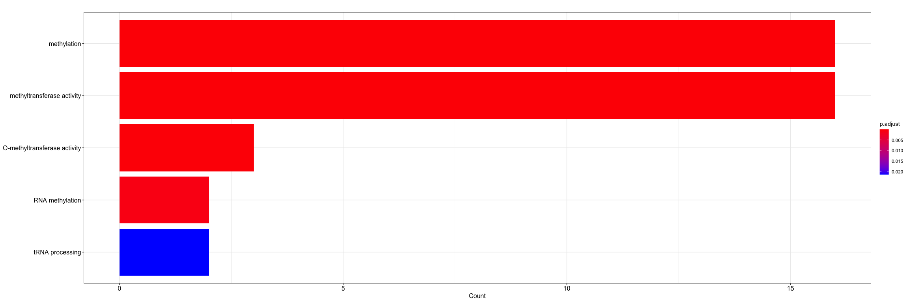
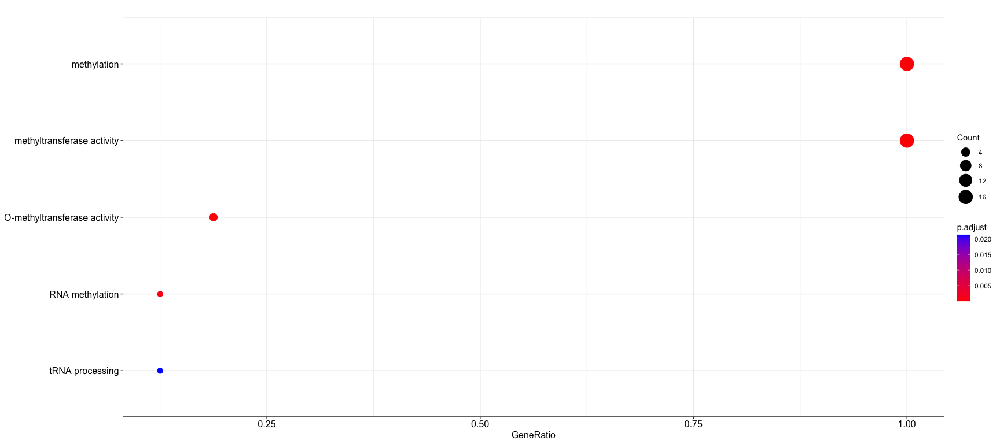
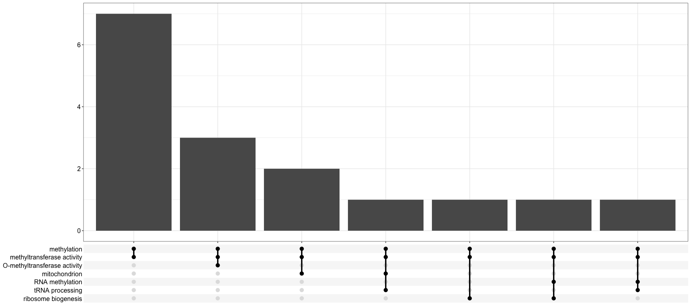
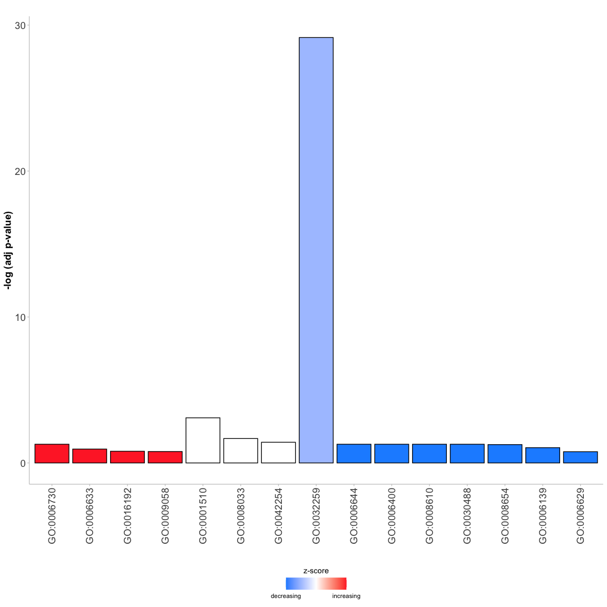
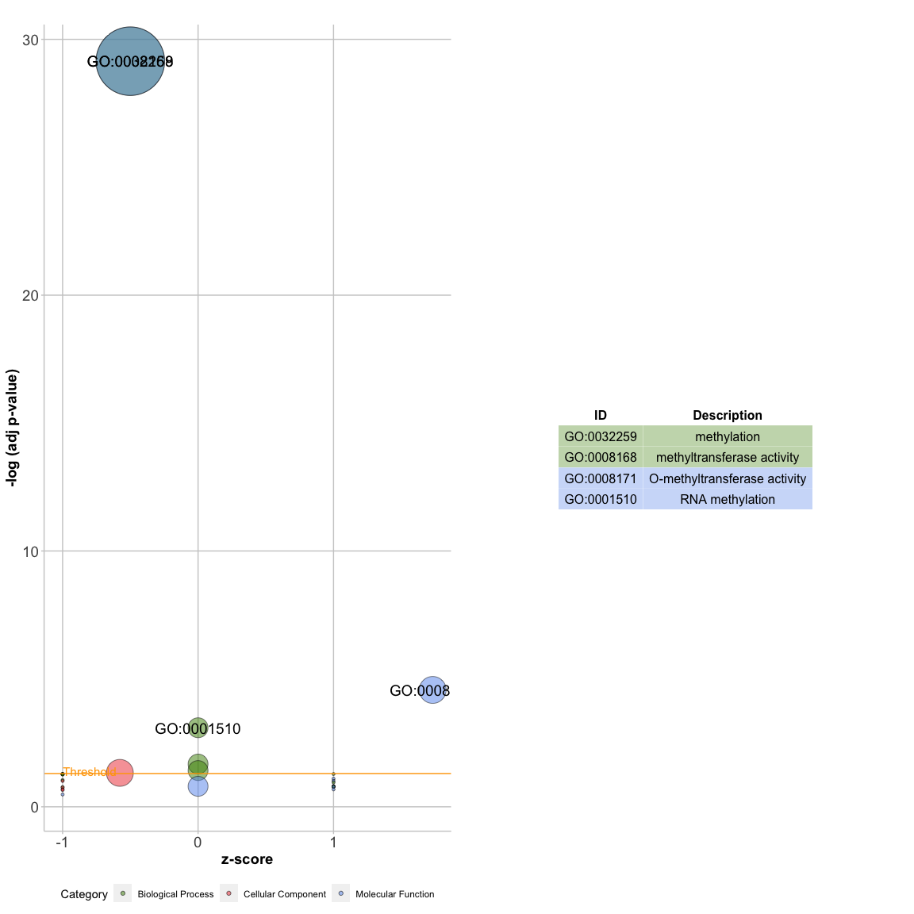

Basic GO Analysis with mogo
================
Dan MacLean
12 April, 2023

## mogo

`mogo` is a package for generating GO analysis using *M*.oryzae genes
only. You can provide the main function with the list of genes of
interest and it does (most of) the rest!

## Installation

To install you’ll need the `devtools` R package. From the R console in
RStudio type

``` r
install.packages("devtools")
```

Once `devtools` is installed you can use that to install `mogo`

``` r
devtools::install_github("TeamMacLean/mogo")
```

## Preparation

The first step is to load our gene expression data file and get a simple
list of genes for GO analysis

### Data loading

First read in your gene expression file. You can do that with
`read_csv()`. Minimally it should contain the gene ID, the log fold
change and the $p$-value.

``` r
library(readr)
library(dplyr)

gene_expression <- read_csv(system.file("extdata","sample_gene_expression.csv", package="mogo"))
gene_expression
#> # A tibble: 132 × 3
#>    gene_id   log2fc  p.adj
#>    <chr>      <dbl>  <dbl>
#>  1 MGG_16981  3.53  0.291 
#>  2 MGG_04557  1.51  0.217 
#>  3 MGG_03894 -7.03  0.255 
#>  4 MGG_09290 -7.19  0.377 
#>  5 MGG_01448  2.11  0.174 
#>  6 MGG_09589 -3.04  0.183 
#>  7 MGG_03476 -0.341 0.199 
#>  8 MGG_16442  3.60  0.0434
#>  9 MGG_01048 -3.36  0.309 
#> 10 MGG_14883 -4.93  0.157 
#> # ℹ 122 more rows
```

### Filter as required

We can now filter the genes to select only the ones with e.g
$p <= 0.05$, using `filter()`

``` r
filtered_gene_expression <- filter(gene_expression, p.adj <= 0.05)
filtered_gene_expression
#> # A tibble: 16 × 3
#>    gene_id   log2fc    p.adj
#>    <chr>      <dbl>    <dbl>
#>  1 MGG_16442  3.60  0.0434  
#>  2 MGG_14022  3.51  0.00180 
#>  3 MGG_00427  0.462 0.0174  
#>  4 MGG_10367 -1.30  0.0215  
#>  5 MGG_00015  0.539 0.0398  
#>  6 MGG_01295 -4.53  0.0360  
#>  7 MGG_05721 -8.60  0.000341
#>  8 MGG_13781  7.58  0.0353  
#>  9 MGG_14886 -0.674 0.00469 
#> 10 MGG_14863 -1.63  0.0322  
#> 11 MGG_01492 -6.62  0.0437  
#> 12 MGG_04901 -2.27  0.0440  
#> 13 MGG_04562 -1.67  0.0439  
#> 14 MGG_00559  0.574 0.0324  
#> 15 MGG_14897  5.88  0.00736 
#> 16 MGG_03526 -0.932 0.0440
```

### Extract the gene id column

We can now extract the `gene_id` column using the `$` syntax

``` r
gene_ids <- filtered_gene_expression$gene_id
gene_ids
#>  [1] "MGG_16442" "MGG_14022" "MGG_00427" "MGG_10367" "MGG_00015" "MGG_01295"
#>  [7] "MGG_05721" "MGG_13781" "MGG_14886" "MGG_14863" "MGG_01492" "MGG_04901"
#> [13] "MGG_04562" "MGG_00559" "MGG_14897" "MGG_03526"
```

## GO enrichment

The GO enrichment is done in the `mogo` package. Load that and use the
`do_enrich()` function, passing it the vector of `gene_ids` to calculate
the enrichment.

``` r
library(mogo)
enrich <- do_enrich(gene_ids)
enrich
#> #
#> # over-representation test
#> #
#> #...@organism     UNKNOWN 
#> #...@ontology     UNKNOWN 
#> #...@gene     chr [1:16] "MGG_16442" "MGG_14022" "MGG_00427" "MGG_10367" "MGG_00015" ...
#> #...pvalues adjusted by 'BH' with cutoff <0.05 
#> #...7 enriched terms found
#> 'data.frame':    7 obs. of  9 variables:
#>  $ ID         : chr  "GO:0032259" "GO:0008168" "GO:0008171" "GO:0001510" ...
#>  $ Description: chr  "methylation" "methyltransferase activity" "O-methyltransferase activity" "RNA methylation" ...
#>  $ GeneRatio  : chr  "16/16" "16/16" "3/16" "2/16" ...
#>  $ BgRatio    : chr  "132/10114" "136/10114" "18/10114" "10/10114" ...
#>  $ pvalue     : num  2.78e-31 4.62e-31 2.61e-06 1.05e-04 3.44e-03 ...
#>  $ p.adjust   : num  7.16e-30 7.16e-30 2.70e-05 8.12e-04 2.13e-02 ...
#>  $ qvalue     : num  3.65e-30 3.65e-30 1.38e-05 4.14e-04 1.09e-02 ...
#>  $ geneID     : chr  "MGG_16442/MGG_14022/MGG_00427/MGG_10367/MGG_00015/MGG_01295/MGG_05721/MGG_13781/MGG_14886/MGG_14863/MGG_01492/M"| __truncated__ "MGG_16442/MGG_14022/MGG_00427/MGG_10367/MGG_00015/MGG_01295/MGG_05721/MGG_13781/MGG_14886/MGG_14863/MGG_01492/M"| __truncated__ "MGG_14022/MGG_00427/MGG_00015" "MGG_05721/MGG_00559" ...
#>  $ Count      : int  16 16 3 2 2 2 3
#> #...Citation
#>  T Wu, E Hu, S Xu, M Chen, P Guo, Z Dai, T Feng, L Zhou, W Tang, L Zhan, X Fu, S Liu, X Bo, and G Yu.
#>  clusterProfiler 4.0: A universal enrichment tool for interpreting omics data.
#>  The Innovation. 2021, 2(3):100141
```

As you can see the `enrich` object has a lot of information in it. The
result table can be extracted using `as.data.frame()` to convert the
`enrich` to a data.frame (note `glimpse` is a helpful function for
printing out big dataframes).

``` r
result_table <- as.data.frame(enrich)
glimpse(result_table)
#> Rows: 7
#> Columns: 9
#> $ ID          <chr> "GO:0032259", "GO:0008168", "GO:0008171", "GO:0001510", "G…
#> $ Description <chr> "methylation", "methyltransferase activity", "O-methyltran…
#> $ GeneRatio   <chr> "16/16", "16/16", "3/16", "2/16", "2/16", "2/16", "3/16"
#> $ BgRatio     <chr> "132/10114", "136/10114", "18/10114", "10/10114", "56/1011…
#> $ pvalue      <dbl> 2.781819e-31, 4.617021e-31, 2.612786e-06, 1.048125e-04, 3.…
#> $ p.adjust    <dbl> 7.156383e-30, 7.156383e-30, 2.699879e-05, 8.122967e-04, 2.…
#> $ qvalue      <dbl> 3.645017e-30, 3.645017e-30, 1.375151e-05, 4.137334e-04, 1.…
#> $ geneID      <chr> "MGG_16442/MGG_14022/MGG_00427/MGG_10367/MGG_00015/MGG_012…
#> $ Count       <int> 16, 16, 3, 2, 2, 2, 3
```

You can save the result to an excel-compatible csv file with,
`write_csv()`

``` r
write_csv(result_table, "my_GO_results.csv")
```

## Plotting

The `enrich` object is from the package `ClusterProfiler` and can be
used directly in most of it’s plot types. See them at the
`ClusterProfiler` page
<http://yulab-smu.top/clusterProfiler-book/chapter12.html#bar-plot>

### Barplot

Works ok, but the text can make it a bit unwieldy

``` r
library(clusterProfiler)
#> clusterProfiler v4.6.2  For help: https://yulab-smu.top/biomedical-knowledge-mining-book/
#> 
#> If you use clusterProfiler in published research, please cite:
#> T Wu, E Hu, S Xu, M Chen, P Guo, Z Dai, T Feng, L Zhou, W Tang, L Zhan, X Fu, S Liu, X Bo, and G Yu. clusterProfiler 4.0: A universal enrichment tool for interpreting omics data. The Innovation. 2021, 2(3):100141
#> 
#> Attaching package: 'clusterProfiler'
#> The following object is masked from 'package:stats':
#> 
#>     filter
library(enrichplot)
barplot(enrich, showCategory=5)
```

<!-- -->

### Dotplot

Similar

``` r
dotplot(enrich, showCategory=5)
```

<!-- -->

### UpSetPlot

These are like a really sophisticated Venn/Euler diagram.
<https://jku-vds-lab.at/tools/upset/>

``` r
upsetplot(enrich)
```

<!-- -->

### GoPlot

Plots from the package `GoPlot` such as bubble plots can be made, but
need you to convert the `enrich` object to a DAVID compatible object,
and make an accessory data.frame of the expression information. Use
`enricher_to_david()` for the first part, and the relevant columns of
the gene expression data you created at the beginning for the second
part.

``` r
david <- enricher_to_david(enrich)
expr_info <- data.frame(
  ID = filtered_gene_expression$gene_id,
  logFC = filtered_gene_expression$log2fc
)
```

Then you can convert that to the data format needed for `GoPlot`

``` r
library(GOplot)
#> Loading required package: ggplot2
#> Loading required package: ggdendro
#> Loading required package: gridExtra
#> 
#> Attaching package: 'gridExtra'
#> The following object is masked from 'package:dplyr':
#> 
#>     combine
#> Loading required package: RColorBrewer
circ <- circle_dat(david, expr_info)
```

### Go Bar

A different sort of GO barchart

``` r
GOBar(subset(circ, category == 'BP'))
```

<!-- -->

### Go Bubble

A plot with bubbles

``` r
GOBubble(circ, labels=3)
```

<!-- -->
